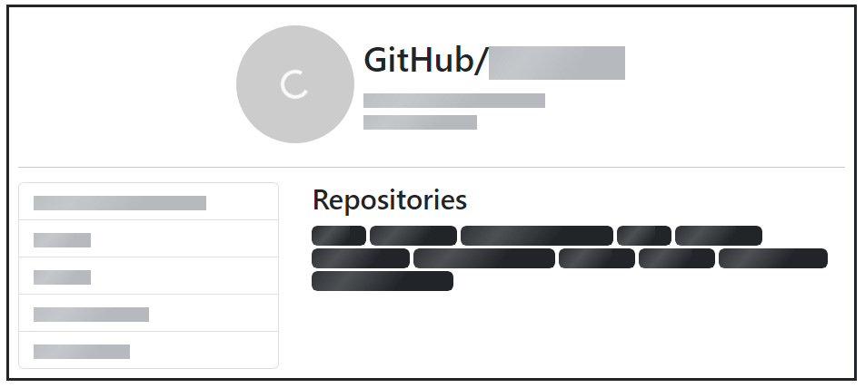
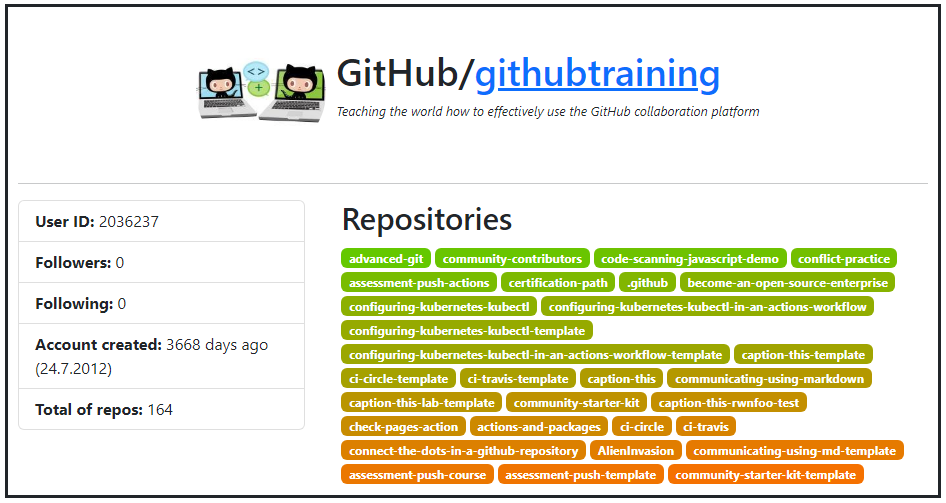

# GitHub User Viewer

Shows (for now) dev's information which is fetched from GitHub API.

   

- - -

## How-To

1. Clone repository `git clone https://github.com/markspl/github-user-viewer.git`
2. Install required packages `npm i`
3. Start `npm run start`

### Addresses

- `/` and `/user/` - Homepage
- `/user/:username/` - GitHub User information. For example, `/user/markspl` ([localhost:3000/user/markspl](http://localhost:3000/user/markspl))

### To-Do
- Create a text input to search user
- Show more information about selected repository
- Show different information if selected user is actually a group
- ...

- - -

### Screenshots

*Placeholders while loading information from API*

*The look how The GitHub Training Team organization (not a profile) is shown. Max 30 repositories.*