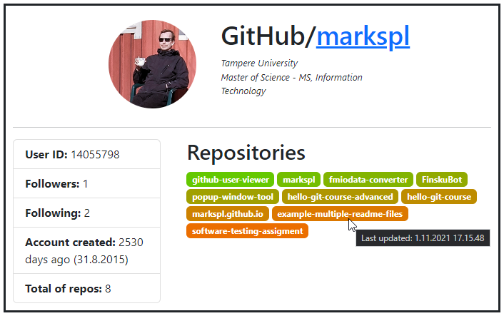

# GitHub User Viewer

Shows (for now) dev's information which is fetched from GitHub API.

  

- - -

## How-To

1. Clone repository `git clone https://github.com/markspl/github-user-viewer.git`
2. Install required packages `npm i`
3. Start `npm run start`